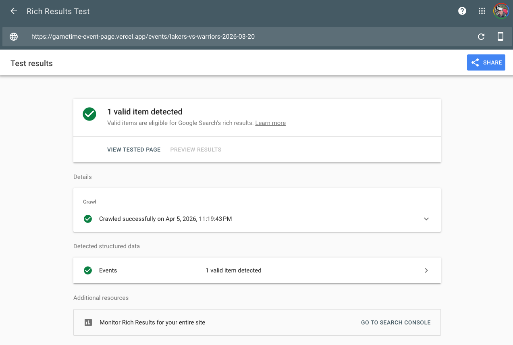
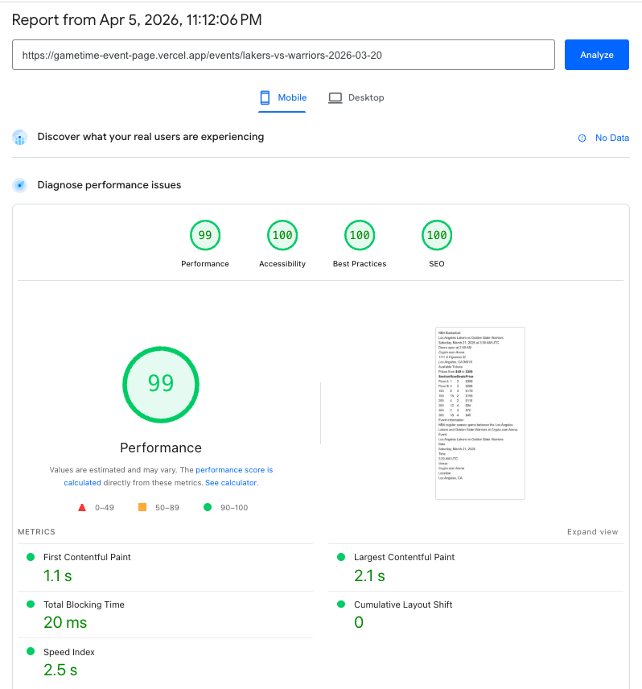
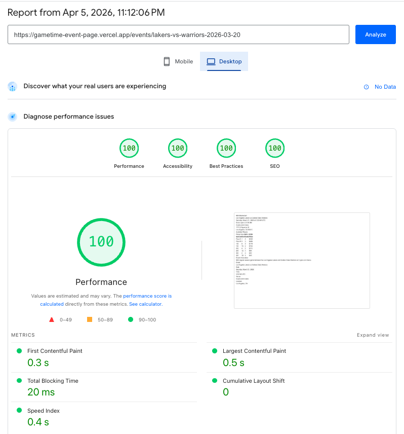

# Gametime Event Page — SEO & Crawlability

A performant, crawl-safe event page for a ticket marketplace. Built to demonstrate how rendering strategy, structured data, and semantic HTML work together to win organic search traffic against competitors like StubHub and SeatGeek.

**Live Demo → [https://gametime-event-page.vercel.app/](https://gametime-event-page.vercel.app/)**

## Getting Started

```bash
pnpm i
pnpm dev
```

Open [http://localhost:3000](http://localhost:3000) and click through to the event page.

To test ISR behavior locally, build and run the production server:

```bash
pnpm build
pnpm start
```

The event page will cache on first load and revalidate every 60 seconds. Ticket prices and availability are randomized on each render, so you can verify revalidation by viewing the page source before and after the 60-second window.

---

## Rendering Strategy: ISR with Client-Side Polling

### Why not CSR?

Client-side rendering is the problem this assessment describes. The crawler receives an empty HTML shell and must execute JavaScript to see content. Even when Google's crawler does render JS, it operates on a budget — there's no guarantee it will wait for API calls to resolve. Meanwhile, the user stares at a blank screen while JavaScript downloads, parses, and fetches data. This fails on both crawlability and performance.

### Why not SSR?

Server-side rendering solves crawlability — the crawler gets complete HTML on every request. But every request hits the origin server and waits for data before sending a single byte. For a high-traffic event page, this means higher infrastructure cost and slower TTFB compared to serving cached static files from a CDN. The origin server becomes the bottleneck.

### Why not SSG?

Static site generation is the fastest option — pre-built HTML served directly from the CDN. But pure SSG requires a full site rebuild to update any page. With thousands of events being created and updated daily, full rebuilds are impractical. Content goes stale until the next deploy.

### Why ISR?

Incremental Static Regeneration gives us SSG's speed with the ability to update pages without rebuilding the site. Each event page is statically generated on first request and cached at the CDN. After a configurable interval (60 seconds in this implementation), the next visitor triggers a background re-render. They still receive the cached version instantly — the fresh version is ready for the visitor after them. New event pages are generated on-demand when first visited, with no build step required.

This means the crawler always receives complete HTML from the CDN with minimal latency. The user gets a near-instant page load. And the content stays reasonably fresh without any server-per-request cost.

### Why not PPR?

Partial Prerendering (Next.js 16) splits a page into a static shell served from the CDN and dynamic holes streamed from the origin server in a single HTTP response. This is architecturally elegant and would provide marginally fresher ticket data on initial render.

However, for this use case, the freshness advantage is negligible. Ticket inventory changes continuously — even data streamed from the origin can be stale by the time the user sees it. The real source of truth is the database at checkout, not the rendering layer. PPR's dynamic streaming would introduce origin server latency on every request for a marginal freshness gain that client-side polling replaces within seconds anyway.

PPR becomes the right choice if Gametime introduces personalized content on event pages — recommended seats based on purchase history, dynamic pricing per user, or logged-in user state. For the current problem of showing the same public inventory to every visitor, ISR with client-side polling is the pragmatic choice with less infrastructure complexity.

### Next.js PPR vs Astro Server Islands

Gametime uses Astro, and the same architecture is achievable there. The static shell would be cached via CDN headers (`s-maxage` + `stale-while-revalidate`), with Server Islands replacing the ticket listing with fresh data for real users. The ISR-cached fallback content in the static shell provides everything the crawler needs — complete HTML with ticket data, JSON-LD, and semantic markup — with no JavaScript dependency.

I chose Next.js for this submission because ISR is a first-class framework primitive — `export const revalidate = 60` versus manually configuring CDN cache headers and platform-specific adapters. For a take-home focused on rendering and SEO decisions, this let me focus on the problem rather than the infrastructure wiring.

PPR has a slight (arguably negligible) performance edge, but it's a first-class primitive only in Next.js (currently). The same streaming pattern is achievable in Astro but requires significantly more infrastructure wiring — it's not a framework limitation, it's a developer experience tradeoff.

### The Full Freshness Architecture

Each layer solves freshness at a different timescale:

- **ISR** (minutes): Keeps the cached page fresh for new visitors arriving from search. The crawler and first-time visitors always get a reasonably recent version.
- **Client-side polling** (30 seconds): After the initial page load, the ticket listing refreshes via API calls. A fan browsing for a few minutes always sees current inventory.
- **Database** (real-time): At checkout, actual seat availability is verified at the transaction layer. No rendering strategy eliminates the need for optimistic locking or reservation queues — inventory integrity is a database concern, not a rendering concern.

### Production Considerations

- **Polling efficiency**: In production, polling should be gated on page visibility (via the Page Visibility API) and user activity to avoid unnecessary API load from idle or backgrounded sessions.
- **On-demand revalidation**: When event details change (rescheduled, cancelled, venue change), the event management system should call `revalidatePath` or `revalidateTag` to immediately invalidate the cached page rather than waiting for the time-based revalidation interval.
- **Cache persistence across deploys**: The default ISR cache is filesystem-based and invalidated on each deployment. In production, a shared cache handler backed by Redis or a similar store would prevent cache cold starts after deploys.
- **WebSockets/SSE vs polling**: I chose polling because it felt sufficient for this problem — it provides stable, batched UI updates without the infrastructure complexity of persistent connections. That said, I'd need to understand Gametime's domain better to evaluate this tradeoff. If users frequently lose tickets between browsing and checkout because inventory moves that fast, SSE or WebSockets may be the right call despite the operational cost. The correct answer depends on the actual velocity of inventory changes and the conversion impact of stale listings.
- **Ticket reservation locking**: Most ticketing platforms implement a mutex-like system where adding tickets to your cart temporarily marks them as unavailable for a fixed window (e.g., 5–10 minutes). This prevents users from losing tickets while entering payment information. This is mostly a backend concern independent of the rendering strategy, but it's worth noting because it further reduces the importance of real-time freshness on the browse page — once a user commits to a ticket, the lock protects them regardless of how fresh the listing data was.

---

## What Googlebot Sees

The crawler receives complete, server-rendered HTML with no JavaScript dependency for any SEO-critical content:

- **Semantic HTML**: `<h1>` for the event name, `<time>` elements with machine-readable `datetime` attributes, `<address>` for the venue, `<table>` with scoped headers for the ticket listing, `<article>`, `<section>`, and `<nav>` for document structure.
- **Meta tags**: `<title>` and `<meta name="description">` with the event name, date, venue, and starting price. Canonical URL via `<link rel="canonical">`. Open Graph tags for social sharing.
- **JSON-LD structured data**: A complete `Event` schema (see below).
- **Full ticket listing**: The ticket table is server-rendered into the HTML as part of the ISR cache. The client-side polling component hydrates after JavaScript loads, but the initial data is in the markup regardless.
- **Sitemap**: Dynamically generated at `/sitemap.xml` from the event data, so new events are discoverable without manual intervention.
- **robots.txt**: Directs crawlers to event pages and away from API endpoints and auth-gated routes.

### Crawler vs Browser

The crawler and the browser receive the same HTML document on initial load. The response includes the full event page with ticket data, JSON-LD, and semantic markup, as well as Next.js script tags and chunks for hydration. A crawler may not execute all of this JavaScript — but it doesn't need to. Every piece of SEO-critical content (event details, ticket listings, structured data, meta tags) is in the static HTML itself, with no JavaScript dependency.

After hydration in the browser, the only meaningful difference is the ticket listing: the `TicketList` client component takes over and begins polling the API every 30 seconds, so the visible ticket data diverges from the original HTML as prices and availability shift. Viewing the page source shows the ISR-cached version (what the crawler indexed), while inspecting the live DOM shows the polling-updated version (what the fan sees).

---

## Structured Data

The page includes JSON-LD using the [Schema.org Event type](https://schema.org/Event):

```json
{
  "@context": "https://schema.org",
  "@type": "Event",
  "name": "Los Angeles Lakers vs Golden State Warriors",
  "startDate": "2026-03-20T19:30:00-08:00",
  "location": {
    "@type": "Place",
    "name": "Crypto.com Arena",
    "address": { "@type": "PostalAddress", ... }
  },
  "performer": [
    { "@type": "SportsTeam", "name": "Los Angeles Lakers" },
    { "@type": "SportsTeam", "name": "Golden State Warriors" }
  ],
  "offers": {
    "@type": "AggregateOffer",
    "lowPrice": "45",
    "highPrice": "350",
    "priceCurrency": "USD",
    "availability": "https://schema.org/InStock"
  }
}
```

**What this signals to Google:**

- `Event` type: This page is about a specific event, not a generic article or product. Eligible for event rich results in search.
- `AggregateOffer` with `lowPrice`/`highPrice`: Enables the price range display in search results ("$45 – $350"). The `InStock` availability signals that tickets are purchasable, not just informational.
- `SportsTeam` performers: Connects to Google's knowledge graph for the Lakers and Warriors, improving relevance for team-specific queries.
- `eventStatus: EventScheduled`: Distinguishes from postponed or cancelled events — important for showing accurate information in search.

The structured data can be validated using [Google's Rich Results Test](https://search.google.com/test/rich-results).



---

## Tradeoffs

- **Next.js over Astro**: Gametime uses Astro, but Next.js has first-class ISR support as a framework primitive. Astro requires implementing ISR through CDN cache headers or platform-specific adapters. I chose Next.js to focus on the rendering and SEO decisions rather than the infrastructure wiring, while noting how the same architecture would translate to Astro.
- **No visual polish**: Per the assessment instructions, the focus is on what's in the HTML, not how it looks in a browser. The page uses minimal styling to keep the code focused on rendering strategy and SEO correctness.
- **Stub data with randomization**: Ticket prices and availability are randomized on each render to demonstrate that ISR revalidation and client-side polling are working. In production, this data comes from an inventory API.
- **ISR over PPR**: ISR serves the complete page from the nearest CDN node with no origin server involvement, delivering the fastest possible TTFB. PPR would introduce origin latency for the ticket module on every request for a marginal freshness gain that client-side polling replaces within seconds. However, if Gametime introduces personalized content on event pages in the future, PPR becomes the right architecture and the current ISR setup can be migrated incrementally by wrapping personalized components in Suspense boundaries.

---

## What I'd Do With More Time

- **Activity-based polling**: Pause polling when the tab is backgrounded or the user is idle, resume on interaction. Reduces unnecessary API load.
- **Sitemap index pagination**: For thousands of events, split the sitemap into multiple files with a sitemap index, staying under the 50,000 URL limit per file.
- **On-demand revalidation webhook**: Wire up event creation and updates to call `revalidatePath` so the cached page refreshes immediately when event details change, rather than waiting for the time-based interval.
- **PPR migration path**: If Gametime introduces personalized content on event pages (recommended seats, user-specific pricing), PPR becomes the right architecture. The current ISR setup can be migrated incrementally by wrapping personalized components in Suspense boundaries.
- **Structured data for individual offers**: Instead of a single `AggregateOffer`, list individual `Offer` entries per ticket section to provide richer data to Google — though this increases the JSON-LD payload size and may not provide additional ranking benefit.
- **Performance monitoring**: Integrate Core Web Vitals reporting to track LCP, CLS, and INP in production, since these are direct ranking signals.
- **API server**: Implement a dedicated server with mocked endpoints for event and ticket data, separating the data layer from the Next.js application. This better represents a production architecture where the web app consumes APIs rather than importing stub data directly.
- **Bounded contexts**: Restructure the repo into a monorepo with clear domain boundaries — the web app would import from a JIT package structure, for example events would receive its own package that handles all the data fetching, types, and utilities related to events. This better reflects a real-world codebase where different teams own different domains of the application.

## Google Lighthouse Results

### Mobile

[Google Lighthouse Mobile](https://pagespeed.web.dev/analysis/https-gametime-event-page-vercel-app-events-lakers-vs-warriors-2026-03-20/szfbkw0wgd?form_factor=mobile)



### Desktop

[Google Lighthouse Desktop](https://pagespeed.web.dev/analysis/https-gametime-event-page-vercel-app-events-lakers-vs-warriors-2026-03-20/szfbkw0wgd?form_factor=desktop)

